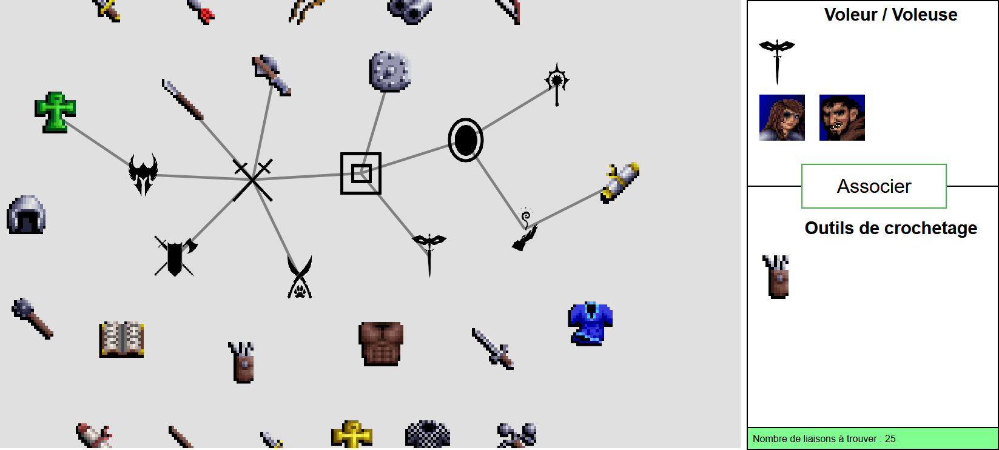

# d3-link-game

Petit jeu utilisant la librairie javascript d3.js, dans lequel il faut trouver des connexions entre éléments.

Il s'agit d'un hommage au jeu vidéo "Eye of the Beholder". Le but est d'associer les classes (ou groupes de classes) de personnages aux armes et aux armures qu'elles ont le droit d'utiliser.

## Comment jouer

TODO : mettre le jeu en ligne sur mon site pythonanywhere. En attendant, le jeu fonctionne en local.

Les classes et groupes de classes de personnages sont déjà liées ensemble, afin de représenter la manière dont ils sont structurés.

Le placement des éléments peut être modifié par des drag&drop.

Pour tenter une association, cliquez sur une classe ou un groupe, puis sur un objet, et sur le bouton "Associer" à droite. Si l'association est correcte, un lien se crée entre les deux éléments, sinon, un message d'erreur s'affiche.

Attention, malgré le fait qu'il y ait des regroupements de classes, certains objets doivent être associés plusieurs fois. Par exemple, la masse d'armes s'associe avec le groupe "Combattant(e)s" et avec la classe "Prêtre(sse)".

Réussirez-vous à trouver toutes les associations ?

## Comment jouer en local

Téléchargez puis décompressez le contenu de ce repository.

Dans le répertoire "code", cliquez sur le fichier `link_game.html`. Le jeu s'ouvre dans votre navigateur web.

## Comment reconfigurer les éléments du jeu

Le jeu est configurable assez facilement.

Les éléments, leurs descriptions et les associations à trouver entre eux sont modifiables.

Le fait d'avoir deux types d'éléments n'est pas modifiables. Dans l'exemple, le premier type correspond aux classes de personnage et le deuxième correspond aux armes et armures.

Rien n'empêche de décider que ces deux types correspondent à d'autres choses. Par exemple : des personnes et des hobbies pratiqués par ces personnes, des fruits et les couleurs de ces fruits, des recettes de cuisine et leurs ingrédients, etc.

Les associations définies dès le départ peuvent se faire entre n'importe quels éléments. Dans l'exemple, on a des associations entre plusieurs classes/groupes de personnage. On pourrait aussi prédéfinir une association entre deux armes (même si ça n'a pas vraiment de sens).

Les associations à trouver sont obligatoirement du premier type vers le deuxième type. On doit trouver l'association entre la Masse d'armes et la classe "Prêtre(sse)". On ne pourrait pas demander au joueur de trouver une association entre la classe "Combattant(e)s" et la classe "Guerrier(e)".

TODO : créer un fichier à part avec les infos à définir dans les fichiers pour reconfigurer.

